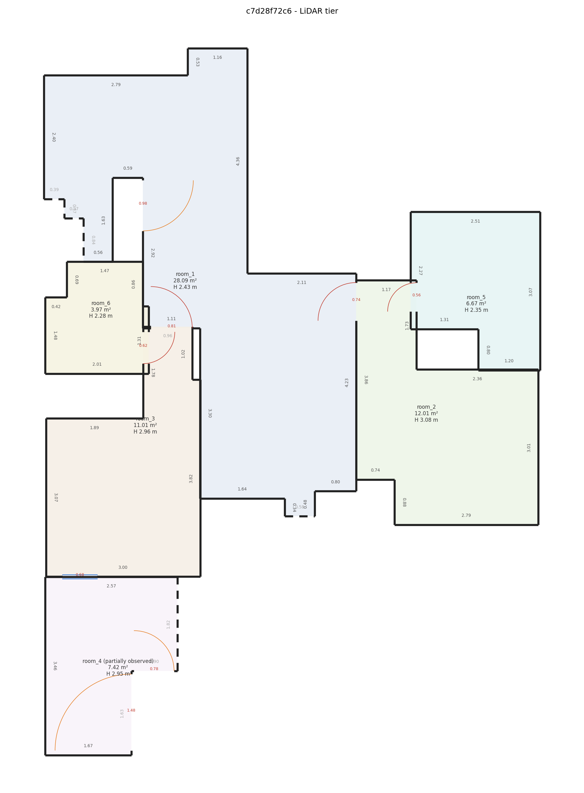

<div align="center">

# Cozmo AI

### Walk through a home with a phone. Get a measured floor plan.

**Rooms · walls · doors · ceilings · floor area · damage · a 95 % range on every number**



*One continuous LiDAR walk → 6 rooms, 5 doors, every wall dimensioned.*

</div>

---

## Three ways in, one plan out

| Tier | Phone | Capture app | Command |
|---|---|---|---|
| **LiDAR** | iPhone Pro | StrayScanner | `python -m cli.run capture --input <folder> --tier lidar --out out/` |
| **Video** | any iPhone 15+ | Spectacular Rec | `scripts/run_video_mac.sh <recording> out/` *(Linux: `--tier video`)* |
| **Photo** | any iPhone | Camera, 8 photos per room | `python -m cli.run capture --input <photos> --tier photo --out out/` |

Out comes `plan.json` (published schema) and `plan.png`. How to capture: [`docs/capture_protocol.md`](docs/capture_protocol.md).

## Run it in 3 minutes

```bash
python3 -m venv .venv && source .venv/bin/activate
pip install -r requirements.txt
python scripts/fetch_models.py        # depth model, checksum-verified
```

Video tier on a Mac also needs **Docker Desktop** (one step uses an x86-only SDK).
Requirements for video on Linux: `pip install -r requirements-video.txt`.

## How good is it? (measured, not claimed)

| | Result |
|---|---|
| LiDAR, 3 sample walks | 3 / 5 / 6 rooms found, doors linked, ceilings measured when filmed |
| Video vs tape, 3 walks | rooms found every time · footprint −4 … −16 % · best walk 2.9 % median wall error |
| Photo vs tape | room 2 area +6 %, room 1 only partly captured |
| Gates | **most per-wall, door and ceiling gates still fail** — intervals are widened to the real error |

Full numbers: [`benchmark/results/home/report.md`](benchmark/results/home/report.md) — regenerate with one command:

```bash
python -m benchmark.run_all --capture-dir data/raw/home \
    --sheet benchmark/ground_truth/home/sheet.json --out benchmark/results/home
```

## Read next

| | |
|---|---|
| What's done, per requirement | [`docs/compliance_matrix.md`](docs/compliance_matrix.md) |
| How it works, where it fails | [`docs/technical_report.md`](docs/technical_report.md) |
| The fix loop (declared → shipped → measured) | [`docs/fix_declaration.md`](docs/fix_declaration.md) |
| Regenerate every number | [`docs/reproduction.md`](docs/reproduction.md) |
| Mirrors, glass, low light | [`docs/hard_surfaces.md`](docs/hard_surfaces.md) |
| Known limitations | [`docs/known_limitations.md`](docs/known_limitations.md) |
| Every design choice, defended | [`docs/design_decisions.md`](docs/design_decisions.md) |

<div align="center">

*Raw captures shipped separately (`data/`) · pretrained models disclosed in the report*

</div>
